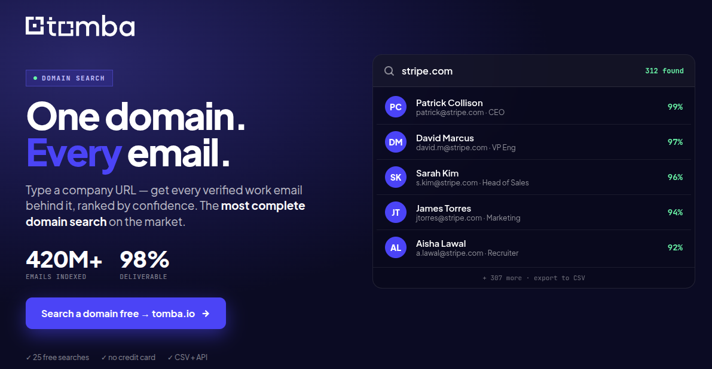

# Framer Site Email Finder

[](https://tomba.io)
[](https://tomba.io/email-finder)
[](https://python.org)

<p align="center">
  <a href="https://tomba.io/domain-search">
    
  </a>
</p>

<p align="center">
  <em>Powered by Tomba's <a href="https://tomba.io/domain-search">Domain Search API</a> — find every verified email behind any company domain.</em>
</p>

<p align="center">
  
</p>

Find the verified contact emails behind any **Framer site** — bulk, by domain. Two ways to get started: a **fully managed** web app, or a **self-service** Python script powered by the Tomba REST API.

---

## Option 1: Tomba Email Finder — Managed Web App (Recommended)

**[Tomba Email Finder](https://tomba.io/email-finder)** is the fastest way to surface verified emails for any company domain — including every Framer site in your target list. No code, no infrastructure, no rotating keys: paste a domain, get every prospect-ready email with score, position, department, and source URL.

**Why teams choose Tomba:**
- 🚀 **Zero setup** — bulk upload a CSV of Framer domains, get results in minutes
- 🤖 **Verified deliverability** — every email runs through Tomba's 7-step verifier (MX, SMTP, catch-all, role, disposable)
- ⚡ **Real-time** — public sources re-crawled continuously, so contact data stays fresh
- 🌍 **Worldwide coverage** — 100M+ verified business emails across every industry
- 🔗 **Plug-and-play integrations** — HubSpot, Salesforce, Pipedrive, Google Sheets, Zapier, Make
- 🛡️ **GDPR / CCPA compliant** — opt-out registry, source attribution, audit trail

**Key use cases:**
- ✅ **Find emails for any Framer site** — by site domain, brand name, or vanity URL
- ✅ **Targeted founder / CEO outreach** — `first_name + last_name + domain` → likely email + score
- ✅ **Bulk CSV enrichment** — upload Framer site domains, download a contact-ready CSV
- ✅ Verify catch-all domains so your cold outbound doesn't bounce
- ✅ Enrich CRM accounts with company size, industry, founded date, and social profiles
- ✅ Feed verified leads directly into outbound sequences or AI SDR tools

> **Free tier: 50 finds + 50 verifications / month, no credit card.** &nbsp;[Get a free key →](https://app.tomba.io/auth/register)

---

## Option 2: Build Your Own with Python

Need results piped into your own pipeline, scheduler, or data warehouse? This repo is a tiny, zero-magic Python script that calls the Tomba REST API directly — no SDK, no framework, one file.

### Build your Framer email finder in minutes

1. **Drop your Framer site domains into a text file**
2. **Run `python framer_emails.py < sites.txt`**
3. **Pipe the JSON / CSV into your CRM, BigQuery, or `jq`**
4. **Edit `framer_emails.py`** to tune fields, filters, or output format — it's <300 lines

### Prerequisites

- Python 3.9 or higher
- A [free Tomba account](https://app.tomba.io/auth/register) (50 finds + 50 verifications/month)
- Your `TOMBA_KEY` + `TOMBA_SECRET` (Dashboard → API)

### Setup

1. **Clone this repository**

   ```bash
   git clone https://github.com/tomba-io/tomba-framer-site-email-finder.git
   cd tomba-framer-site-email-finder
   ```

2. **Install dependencies**

   ```bash
   pip install -r requirements.txt
   ```

3. **Configure credentials**

   Copy `.env.example` to `.env` and fill in your values:

   ```bash
   cp .env.example .env
   ```

   ```env
   TOMBA_KEY=ta_xxxxxxxxxxxxxxxxxxxxxxxxxxxxxxxx
   TOMBA_SECRET=ts_xxxxxxxx-xxxx-xxxx-xxxx-xxxxxxxxxxxx
   ```

   > **Loading the env file:** in bash, `set -a; source .env; set +a` exports both variables for the current shell.

---

## Usage

Once `TOMBA_KEY` and `TOMBA_SECRET` are in your environment, the Python interface works three ways:

### 1. Find Emails by Framer Site Domain

Pass a list of site domains to bulk-retrieve every contact email Tomba has for each:

```python
from framer_emails import find_emails_by_site

sites = [
    "framer.com",
]

results = find_emails_by_site(sites, limit_per_store=10)
for r in results:
    print(f"{r['site']:20} {r['email']:35} score={r['score']} {r['position']}")
```

Or run directly from the shell:

```bash
# args
python framer_emails.py framer.com

# stdin (one domain per line)
cat examples/framer-sites.txt | python framer_emails.py

# CSV out
cat examples/framer-sites.txt | python framer_emails.py --csv > framer-emails.csv
```

### 2. Targeted Lookup: known person at a known site

When you already have a first / last name (e.g. from a LinkedIn search) and just want the working email:

```python
from framer_emails import find_specific_person

hit = find_specific_person("framer.com", first_name="Koen", last_name="Bok")
print(hit["email"], hit["score"], hit["position"])
```

### 3. Verify deliverability

Run any email through Tomba's verifier before you send:

```python
from framer_emails import verify_email

check = verify_email("ceo@framer.com")
print(check["result"], check["score"], check["status"])
# -> deliverable 99 Valid
```

---

## The curl equivalent

The script is just a polite wrapper around one HTTP call per domain. If you'd rather skip Python entirely:

```bash
curl -G 'https://api.tomba.io/v1/domain-search' \
     --data-urlencode 'domain=framer.com' \
     --data-urlencode 'limit=10' \
     -H "X-Tomba-Key: $TOMBA_KEY" \
     -H "X-Tomba-Secret: $TOMBA_SECRET" \
  | jq '.data.emails[] | {email, score, position, department}'
```

### Full curl reference — every parameter, every endpoint

The [`examples/curl/`](./examples/curl/) directory ships **13 runnable bash scripts** covering every `/domain-search` parameter plus the related `/email-count`, `/email-finder`, and `/email-verifier` endpoints. Each script has a matching `*.output.json` captured from the live API, so you can see exactly what the response looks like before spending a credit.

| | Script | What it shows |
|--|--------|---------------|
| 01 | [`01-basic-search.sh`](./examples/curl/01-basic-search.sh) | Plain `domain=` call |
| 02 | [`02-paginated.sh`](./examples/curl/02-paginated.sh) | `page=2 & limit=5` pagination |
| 03 | [`03-personal-only.sh`](./examples/curl/03-personal-only.sh) | `type=personal` — drop shared inboxes |
| 04 | [`04-generic-only.sh`](./examples/curl/04-generic-only.sh) | `type=generic` — only `info@`, `press@`, … |
| 05 | [`05-by-department-executive.sh`](./examples/curl/05-by-department-executive.sh) | `department=executive` — founders, C-suite |
| 06 | [`06-by-department-marketing.sh`](./examples/curl/06-by-department-marketing.sh) | `department=marketing` |
| 07 | [`07-by-country-us.sh`](./examples/curl/07-by-country-us.sh) | `country=US` geo-filter |
| 08 | [`08-combined-filters.sh`](./examples/curl/08-combined-filters.sh) | Stacked filters: US execs only |
| 09 | [`09-live-smtp-verify.sh`](./examples/curl/09-live-smtp-verify.sh) | `live=true` real-time SMTP probe |
| 10 | [`10-enrich-mobile.sh`](./examples/curl/10-enrich-mobile.sh) | `enrich_mobile=true` (paid add-on) |
| 11 | [`11-email-count.sh`](./examples/curl/11-email-count.sh) | `/v1/email-count` — totals per dept + seniority |
| 12 | [`12-email-finder.sh`](./examples/curl/12-email-finder.sh) | `/v1/email-finder` — guess by name |
| 13 | [`13-email-verifier.sh`](./examples/curl/13-email-verifier.sh) | `/v1/email-verifier` — deliverability |

See [`examples/curl/README.md`](./examples/curl/README.md) for the full parameter reference table.

---

## Output Fields

Each result record contains the following fields:

| Field | Description |
|-------|-------------|
| `site` | Company name (from Tomba's organization graph) |
| `domain` | Framer site domain queried |
| `email` | Verified business email |
| `first_name` | Contact first name |
| `last_name` | Contact last name |
| `full_name` | Contact full name |
| `position` | Job title at the site |
| `department` | Functional department (`executive`, `marketing`, `sales`, ...) |
| `seniority` | Seniority level (`executive`, `senior`, `junior`) |
| `type` | `personal` or `generic` (info@, support@, ...) |
| `country` | ISO country code of the contact |
| `linkedin` | LinkedIn profile URL |
| `twitter` | Twitter handle |
| `score` | Tomba confidence score (0–100) |
| `verification_status` | `valid`, `invalid`, `accept_all`, `unknown` |
| `industries` | Industry tag for the site |
| `company_size` | Headcount band (e.g. `251-1K`) |
| `founded` | Year the site was founded |
| `error` | Per-domain error message (empty on success) |

### Sample output

```json
[
  {
    "site": "Framer",
    "domain": "framer.com",
    "email": "teresa@framer.com",
    "first_name": "Teresa",
    "last_name": "Lynch",
    "full_name": "Teresa Lynch",
    "position": "Head People",
    "department": "",
    "seniority": null,
    "type": "personal",
    "country": "NL",
    "linkedin": "https://www.linkedin.com/in/teresalynch1",
    "twitter": null,
    "score": 100,
    "verification_status": "valid",
    "industries": "Information Technology and Services",
    "company_size": "51-250",
    "founded": null,
    "error": ""
  }
]
```

A full canonical example lives in [`sample_output.json`](./sample_output.json).

---

## Advanced Options

The `find_emails_by_site()` function accepts optional parameters:

| Parameter | Type | Default | Description |
|-----------|------|---------|-------------|
| `limit_per_store` | integer | `10` | Max emails per domain. Snaps to nearest of `{5, 10, 50, 100}` (Tomba constraint) |
| `client` | `TombaClient` | new | Reuse one client across calls (preserves rate-limit throttle) |

CLI flags:

| Flag | Description |
|------|-------------|
| `--csv` | Emit CSV to stdout instead of JSON |
| `--limit N` | Cap emails per site (default 10) |
| `--rps N` | Throttle: requests per second (default 5, env: `TOMBA_RPS`) |
| `--version` | Print version and exit |

---

## Common questions

**Will this work for `*.framer.website` subdomains?**
Yes. Tomba treats `example.framer.website` the same as any other domain — though most Framer sites have a custom domain by the time they're worth prospecting. If you only have the Framer subdomain, try both.

**Does Tomba detect that a site is on Framer?**
Yes, but separately. Use the [Tomba Technology Finder API](https://docs.tomba.io/) (or the official [`tomba-io/tomba`](https://github.com/tomba-io/tomba) CLI's `technology` command) to detect the tech stack of a domain (Framer, WordPress, Magento, etc.) before running this script — useful if your input is a mixed list of sites.

**What about rate limits?**
The free plan allows 25 requests / second. The script throttles to 5 RPS by default; bump it with `--rps 25` once you're on a paid plan.

---

## Resources

### Tomba products
- 🌐 [Tomba Homepage](https://tomba.io)
- 🔎 [Domain Search](https://tomba.io/domain-search) — the endpoint this repo wraps
- ✉️ [Email Finder](https://tomba.io/email-finder)
- ✅ [Email Verifier](https://tomba.io/email-verifier)
- 🏗️ [REST API Documentation](https://docs.tomba.io)
- 🔑 [Get a free API key](https://app.tomba.io/auth/register) — 50 finds + 50 verifications / month, no card

### Official Tomba CLI & SDKs
- 🛠️ [`tomba-io/tomba`](https://github.com/tomba-io/tomba) — official CLI utility (Go) for `find`, `verify`, `search`, `technology`, and more
- 🐍 [`tomba-io/python`](https://github.com/tomba-io/python) — Python SDK
- 🟢 [`tomba-io/node`](https://github.com/tomba-io/node) — Node SDK
- 🐹 [`tomba-io/go`](https://github.com/tomba-io/go) — Go SDK
- 🐘 [`tomba-io/php`](https://github.com/tomba-io/php) — PHP SDK
- 💎 [`tomba-io/ruby`](https://github.com/tomba-io/ruby) — Ruby SDK

### Integrations
- 🤖 [`tomba-io/tomba-mcp-server`](https://github.com/tomba-io/tomba-mcp-server) — MCP server for Claude / LLM agents
- 🔌 [`tomba-io/zapier`](https://github.com/tomba-io/zapier) — Zapier integration
- 🔄 [`tomba-io/n8n-nodes-tomba`](https://github.com/tomba-io/n8n-nodes-tomba) — n8n nodes
- 🧩 [`tomba-io/email-finder-vs-code-extension`](https://github.com/tomba-io/email-finder-vs-code-extension) — VSCode extension
- 🔍 [`tomba-io/tomba-maltego`](https://github.com/tomba-io/tomba-maltego) — Maltego transforms for OSINT

### Apify actors (no-code)
- [`tomba-io/domain-search`](https://github.com/tomba-io/domain-search) — same endpoint, runnable as an Apify actor
- [`tomba-io/email-finder`](https://github.com/tomba-io/email-finder)
- [`tomba-io/email-verifier`](https://github.com/tomba-io/email-verifier)
- [`tomba-io/linkedin-finder`](https://github.com/tomba-io/linkedin-finder)
- [`tomba-io/technology-finder`](https://github.com/tomba-io/technology-finder)

---

## License

MIT — see [LICENSE](./LICENSE).

---

*Built with [Tomba](https://tomba.io) — the email finder & verifier trusted by sales, recruiting, and research teams worldwide.*
